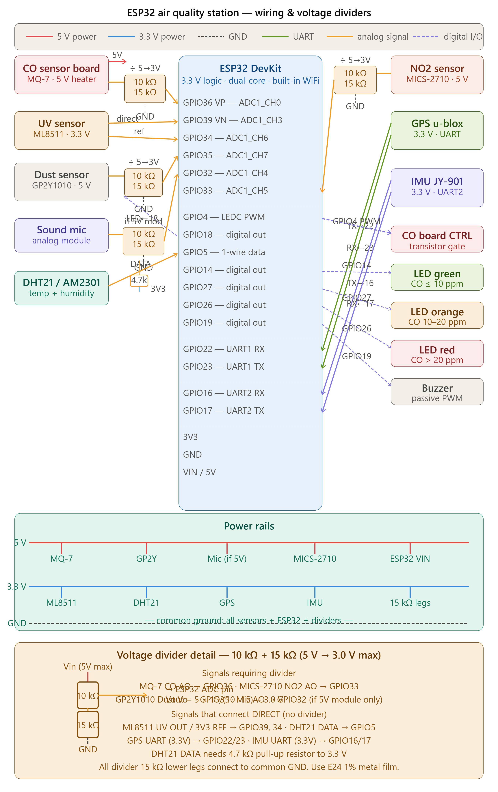

# Outdoor Air Quality Station

> *A portable environmental monitor that logs CO, NO₂, UV, particulate matter,
> sound, temperature, humidity, and orientation — with live GPS coordinates
> streaming to a self-hosted Blynk dashboard for real-time air-quality mapping.*

**ESP32 · FreeRTOS dual-core · Blynk 0.6.1 local server · u-blox GPS · 8 sensors**

---

## Table of contents

1. [The story](#the-story)
2. [Sensor suite](#sensor-suite)
3. [Why the hardware changed](#why-the-hardware-changed)
4. [Pin mapping](#pin-mapping)
5. [Wiring and voltage dividers](#wiring-and-voltage-dividers)
6. [Firmware architecture](#firmware-architecture)
7. [CO sensor — calibration and state machine](#co-sensor--calibration-and-state-machine)
8. [GPS initialisation](#gps-initialisation)
9. [IMU protocol](#imu-protocol)
10. [Fault detection and engineering messages](#fault-detection-and-engineering-messages)
11. [Blynk setup](#blynk-setup)
12. [Configuration reference](#configuration-reference)
13. [Required libraries](#required-libraries)
14. [Air quality mapping](#air-quality-mapping)
15. [Known limitations and future work](#known-limitations-and-future-work)
16. [System Health Diagnostics](#system-health-diagnostics)

---

## The story

### 2017 — the original build

This project began as a DIY answer to a simple question: *what is the air actually
like outside, and where is it worst?*

The first version was built around an **Arduino Mega 2560** — the natural choice
at the time for a project needing multiple hardware UARTs, many analogue inputs,
and enough flash to hold a complex sketch. The station was designed to ride on a
vehicle or backpack, measuring urban pollutants in real time and pushing data over
WiFi to a server so readings could be plotted on a map.

The CO measurement presented the most interesting engineering challenge. The MQ-7
sensor demands an alternating power cycle — 60 seconds at ~5 V to heat and
regenerate the sensing element, then 90 seconds at ~1.4 V while the actual
resistance measurement is taken. On the Mega this was handled through a custom
transistor switching board driven by Timer2 hardware PWM registers (`TCCR2A`,
`OCR2B`). A duty-cycle calibration sweep ran at startup to find the exact PWM
width that produced the correct low-heat voltage on the sensor node.

A separate **ESP8266 module** on UART3 handled WiFi using the `Esp8266EasyIoT`
library. The GPS and IMU each occupied their own hardware UART. Everything —
sensor reads, GPS parsing, IMU protocol, WiFi transmission, display updates —
ran sequentially in a single `loop()`, with a soft-reset watchdog calling
`asm volatile("jmp 0")` every ten minutes as a field reliability backstop.

Despite its architecture the system worked. It logged real data from real drives
through real city air.

### 2024 — the migration

Seven years on, the limitations of the original design had become production
blockers rather than acceptable trade-offs:

- The single sequential loop meant GPS data was always several hundred milliseconds
  stale. IMU frames were routinely dropped during long sensor reads.
- The ESP8266 was an additional failure point, consumed an entire UART, and
  required careful baud-rate handshaking to stay in sync with the Mega.
- The Mega's 10-bit ADC at 5 V limited precision on the ratiometric UV sensor and
  produced noisier readings throughout.
- Timer2 register manipulation was AVR-specific — the CO PWM logic could not be
  ported to any other architecture without a complete rewrite.
- There was no fault detection. When something went wrong in the field, the only
  diagnostic was silence.

The **ESP32 DevKit** addressed every one of these. Two Xtensa LX6 cores running
FreeRTOS allow sensor work and network work to run concurrently, with a proper
mutex protecting shared data. The built-in WiFi eliminates the ESP8266 entirely.
The LEDC peripheral replaces Timer2. A 12-bit ADC at 3.3 V improves resolution and
reduces noise. And a structured engineering-message system means the station can
now tell you exactly what it is doing and what has gone wrong.

The backend also moved from the original proprietary IoT library to a
**self-hosted Blynk 0.6.1 server** (patched for Java 21 compatibility), running
on local home infrastructure. No data leaves the local network.

---

## Sensor suite

| Sensor | Parameter measured | Interface | Supply voltage |
|---|---|---|---|
| MQ-7 (custom heater board) | Carbon monoxide (CO ppm) | Analogue + PWM heater control | 5 V |
| MICS-2710 | Nitrogen dioxide (NO₂) | Analogue | 5 V |
| ML8511 | UV index (UVI) | Analogue ratiometric | 3.3 V |
| Sharp GP2Y1010AU0F | Particulate matter / dust density | Analogue + IR LED control | 5 V |
| Analogue microphone module | Sound level (peak-to-peak voltage) | Analogue | 3.3 V or 5 V |
| DHT21 / AM2301 | Temperature · relative humidity | Single-wire | 3.3 V |
| JY-901 / WT901 | Roll · Pitch · Yaw · IMU temperature | UART 115200 baud | 3.3 V |
| u-blox GPS module | Position · satellite count · HDOP | UART 9600 → 115200 baud | 3.3 V |

---

## Why the hardware changed

| Problem on the Mega + ESP8266 | Solution on the ESP32 |
|---|---|
| Single `loop()` — all subsystems compete for time | Two FreeRTOS tasks pinned to separate cores |
| Separate ESP8266 WiFi module on UART3 | Built-in WiFi — external module removed entirely |
| 10-bit ADC at 5 V | 12-bit ADC at 3.3 V (ADC1 only with WiFi active) |
| Timer2 registers for CO PWM — AVR-specific | LEDC peripheral — `ledcSetup()` / `ledcWrite()` |
| `serialEvent2()` ISR — no equivalent on ESP32 | Manual `pollIMU()` polling per sensor loop cycle |
| `asm volatile("jmp 0")` watchdog reset | `ESP.restart()` — clean software reset on Xtensa |
| No fault detection or telemetry | Per-subsystem watchdogs + engineering messages to Blynk V19 |
| UART3 consumed by WiFi link | UART1 (GPS) and UART2 (IMU) both fully available |

---

## Pin mapping

### Analogue inputs — ADC1 only

> The ESP32 WiFi driver disables ADC2 at runtime. Every analogue signal in this
> project is routed to ADC1 (GPIO 32–36, 34, 35, 39). GPIO 26 and 27 appear in
> ADC2 but are used as digital outputs only — this is safe.

| Signal | Original Mega pin | ESP32 GPIO | ADC channel | Notes |
|---|---|---|---|---|
| CO sensor AO | A0 / A1 | **36 (VP)** | ADC1_CH0 | Input-only · **voltage divider required** |
| UV output | A2 | **39 (VN)** | ADC1_CH3 | Input-only · direct 3.3 V connection |
| UV 3.3 V reference | A3 | **34** | ADC1_CH6 | Input-only · direct 3.3 V connection |
| Dust sensor AO | A4 | **35** | ADC1_CH7 | Input-only · **voltage divider required** |
| Microphone AO | A5 | **32** | ADC1_CH4 | Divider required only if module runs at 5 V |
| NO₂ sensor AO | A7 | **33** | ADC1_CH5 | **Voltage divider required** |

### Digital I/O

| Signal | Original Mega pin | ESP32 GPIO | Direction | Notes |
|---|---|---|---|---|
| CO heater PWM | D9 | **4** | Output | LEDC channel 0 — avoids all strapping pins |
| Dust IR LED (active LOW) | D53 | **18** | Output | |
| DHT21 data | D45 | **5** | Bidirectional | Strapping pin; DHT idle = HIGH → safe at boot |
| LED green (CO ≤ 10 ppm) | D10 | **14** | Output | |
| LED orange (CO 10–20 ppm) | D11 | **27** | Output | ADC2 pin used as output — no conflict |
| LED red (CO > 20 ppm) | D12 | **26** | Output | ADC2 pin used as output — no conflict |
| Buzzer | D7 | **19** | Output | LEDC channel 1 for tone generation |

### UART

| Bus | Original | ESP32 UART | RX GPIO | TX GPIO | Baud rate | Notes |
|---|---|---|---|---|---|---|
| GPS | Serial1 | UART1 | **22** | **23** | 9600 → 115200 | Remapped: default GPIO 9/10 conflict with flash |
| IMU | Serial2 | UART2 | **16** | **17** | 115200 | Default UART2 pins — no conflict |
| Debug | USB | UART0 | 3 | 1 | 115200 | Standard USB serial |
| ~~WiFi (removed)~~ | ~~Serial3~~ | — | — | — | — | Replaced by ESP32 built-in WiFi |

---

## Wiring and voltage dividers

Several sensors run on a 5 V supply and their analogue outputs can swing up to
the full 5 V rail — well above the ESP32 GPIO's 3.3 V absolute maximum. A
resistor voltage divider on each affected signal line scales the worst-case
output down to a safe 3.0 V, leaving a comfortable 0.3 V margin.

<p align="left">
  
</p>

### Divider schematic
Stanard:

```
    Sensor AO
    (5 V max)
        │
      10 kΩ  ← R1 (series)
        │
        ├──────────────────── → ESP32 ADC pin
        │                       Vout = 5 V × 15/(10+15) = 3.00 V  ✓
      15 kΩ  ← R2 (to GND)
        │
       GND
```

My case (based on available **10 kΩ** resistors):

```
    Sensor AO
    (5 V max)
        │
      10 kΩ  ← R1 (series)
        │
        ├──────────────────── → ESP32 ADC pin
        │                       Vout = 5 V × 20/(10+(10+10)) = 3.33 V  ✓
      10 kΩ  ← R2 (to GND)
        │
      10 kΩ  ← R3 (to GND)
        │
       GND
```

Use **E24 series 1 % metal-film resistors** or in my case **0805 0.5% chip resistor**. The total divider impedance 
of **30 kΩ** (my case) or 25 kΩ (standard) is negligible compared to the ESP32 ADC's input impedance (~1 MΩ), so loading
error is immeasurably small.

### Which signals need a divider

| Signal | ESP32 GPIO | Divider | Reason |
|---|---|---|---|
| MQ-7 CO analogue out | 36 | 10 kΩ + 15 kΩ or **10 kΩ + (10 kΩ + 10 kΩ)** | Vo is referenced to the 5 V heater supply |
| MICS-2710 NO₂ analogue out | 33 | 10 kΩ + 15 kΩ or **10 kΩ + (10 kΩ + 10 kΩ)** | 5 V supply — output can reach 5 V |
| GP2Y1010 dust Vo | 35 | 10 kΩ + 15 kΩ or **10 kΩ + (10 kΩ + 10 kΩ)** | 5 V supply — Vo up to ~3.5 V |
| Microphone AO | 32 | 10 kΩ + 15 kΩ or **10 kΩ + (10 kΩ + 10 kΩ)** | Only if the module is powered at 5 V |
| ML8511 UV OUT and REF | 39 / 34 | None — direct connection | 3.3 V ratiometric output |
| DHT21 DATA | 5 | None — direct + 4.7 kΩ pull-up to 3.3 V | 3.3 V logic, open-drain bus |
| GPS UART (TX/RX) | 22 / 23 | None — direct connection | 3.3 V module |
| IMU UART (TX/RX) | 16 / 17 | None — direct connection | 3.3 V module |

> **Dust density firmware correction** — because the GP2Y1010 Vo is scaled down
> by the divider (factor 3/5), the firmware multiplies the ADC voltage back up by
> 5/3 (or in my case **2/3**) before applying the `0.17 × Vo − 0.1` calibration curve. 
> Without this correction dust density would read approximately 40 % too low.

---

## Firmware architecture

### Dual-core FreeRTOS task split

```
Core 0 ── blynkTask ──────────────────────────────────────────────────────────
  WiFi connect on startup; reconnect watchdog every 30 s
  Blynk.run() + BlynkTimer loop
  Snapshot SensorData struct under mutex → virtualWrite all 20 pins every 5 s
  Engineering message flush to V19 every 10 s

Core 1 ── sensorTask ─────────────────────────────────────────────────────────
  UV, NO₂, sound, dust reads every loop cycle (~25 ms cadence)
  DHT21 temperature and humidity
  CO state machine — tickCO() drives the heat/measure cycle
  GPS serial feed → TinyGPS++ decode → position, HDOP, satellite count
  IMU frame polling → Roll, Pitch, Yaw, temperature
  Per-subsystem watchdog checks and status flag updates
  LED indicator logic and optional OLED update
  Write all results to shared SensorData struct under mutex

loop() ───────────────────────────────────────────────────────────────────────
  Immediately calls vTaskDelete(NULL) — frees ~8 KB stack
  All work is driven by the two named tasks above
```

A `SemaphoreHandle_t dataMutex` guards the `SensorData` struct. `blynkTask`
takes a full atomic snapshot copy before writing to Blynk, so neither task ever
sees a struct that is mid-update.

### Shared data struct

```cpp
struct SensorData {
  float    co_ppm, co_raw;           
  byte     co_phase;   
  bool     co_fault;
  float    no2_raw, no2_voltage;
  float    uvi;
  float    sound_v;
  float    dust_mg;
  float    temp, hum;                
  bool     dht_fault;
  float    angle[3], imu_temp;       
  bool     imu_ok;
  double   lat, lng;   
  float    hdop, sats;   
  bool     gps_fix;
  uint32_t status_flags;
  char     eng_msg[128];
  int      rand_num;
};
```

---

## CO sensor — calibration and state machine

### How the MQ-7 works

The MQ-7 tin-oxide element must alternate between two operating voltages. High
voltage burns off contamination and resets the surface; low voltage is when
the resistance is actually sensitive to CO concentration:

```
 ┌──────────────────────────┐     60 s      ┌──────────────────────────┐
 │      Heating phase       │ ────────────▶ │    Measurement phase     │
 │   duty = 255  (~5 V)     │               │  duty = opt_width (~1.4V) │
 │      phase = 1           │ ◀──────────── │      phase = 0           │
 └──────────────────────────┘     90 s      └──────────────────────────┘
```

At startup `pwm_adjust()` sweeps the LEDC duty from 0 to 249, sampling the
voltage on the MQ-7 sense node via GPIO 36 after a 50 ms settle at each step.
It stops when the voltage crosses 1.4 V and stores the nearest duty value as
`opt_width`. This approach is hardware-independent — it compensates automatically
for any variation in transistor gain on the custom CO board.

### Resistance-to-ppm conversion

```
R_sensor  = R_ref × (4095 / ADC_reading) − R_ref
CO_ppm    = 100 × (exp(R_100ppm / R_sensor) − 1.648)
```

`R_ref` = 9.98 kΩ (reference resistor). `R_100ppm` is derived from either a
known-concentration calibration source, or approximated as `R_clean_air × 0.5`
using the MQ-7 datasheet ratio for clean air vs 100 ppm CO.

### Calibration — required before first deployment

Power the station outdoors in clean air. Wait for the first full measurement
phase to complete (90 s). Read the raw ADC value from the Serial monitor
and enter it as `sensor_reading_clean_air` in the sketch.

> A fresh MQ-7 element needs **24–48 hours** of continuous operation at working
> voltage before readings stabilise. Do not calibrate on a brand-new sensor.

### Watchdog protection

If either phase runs longer than `CO_PHASE_MAX_MS` (3 minutes), the firmware
flags `STATUS_CO_FAULT`, sends an engineering message, and forces a phase
transition to break any deadlock. ADC readings at the rail (below 10 or above
4085 counts) are silently rejected — they indicate an open circuit or missing
sensor — and the exponential moving average is not updated.

---

## GPS initialisation

The u-blox module is configured at startup via a `UBLOX_INIT[]` byte array
transmitted over UART1. The array was fully audited and corrected from the
original 2017 version:

| Change | Detail |
|---|---|
| All checksums verified | Automated byte-level check confirmed all 8 UBX messages are valid |
| GGA explicitly enabled | `CFG-MSG` for GGA set to rate = 1 before disabling all other sentences |
| Rate changed from 10 Hz to **5 Hz** | 10 Hz was marginal alongside FreeRTOS task scheduling; 5 Hz is reliable |
| Stray `CFG-PRT` POLL byte removed | Was sent after the baud-switch command — GPS had already changed speed and ignored it |
| **15 ms inter-message delay** added | u-blox requires ~10 ms per `CFG-` command; back-to-back transmission risked the baud switch being lost |

After the `CFG-PRT` command switches the GPS to 115200 baud, `gps_serial` is
torn down and restarted at the new speed. `feedGPS(150)` runs once per sensor
loop, polling the UART for up to 150 ms and passing bytes to TinyGPS++, which
extracts latitude, longitude, HDOP, and satellite count from `$GPGGA` sentences
— the only NMEA message left enabled.

---

## IMU protocol

The JY-901 / WT901 transmits framed 11-byte packets at 115200 baud over UART2:

```
Byte  0      0x55  — frame header
Byte  1      0x53  — angle output packet type
Bytes 2–3    Roll  as signed int16  →  Roll  = value / 32768 × 180°
Bytes 4–5    Pitch as signed int16  →  Pitch = value / 32768 × 180°
Bytes 6–7    Yaw   as signed int16  →  Yaw   = value / 32768 × 180°
Bytes 8–9    Temperature as int16   →  T     = value / 340 + 36.25 + offset
Byte  10     Checksum
```

The original `serialEvent2()` ISR (which has no equivalent on the ESP32) is
replaced by `pollIMU()` — a manual polling function called once per sensor loop
with a 200 ms timeout. If no valid angle frame arrives within `IMU_TIMEOUT_MS`
(5 s), `STATUS_IMU_STUCK` is raised and an engineering message is sent.

---

## Fault detection and engineering messages

Every subsystem runs an independent watchdog. Faults surface through two
dedicated Blynk virtual pins:

- **V19** — the last engineering message as a human-readable string, updated
  within 10 s of any event
- **V20** — the full system status bitmask, updated every 5 s alongside sensor
  data; build a LED/label widget on this pin to see health at a glance

### Watchdog table

| Subsystem | Trigger condition | Timeout | Action taken |
|---|---|---|---|
| CO phase | Phase not transitioning normally | `CO_PHASE_MAX_MS` = 3 min | Force transition · raise `STATUS_CO_FAULT` |
| CO ADC | Reading at rail (< 10 or > 4085 counts) | Immediate | Reject value · skip EMA update · log warning |
| GPS fix | Valid fix with ≥ 4 satellites not present | `GPS_TIMEOUT_MS` = 15 s | Hold last position + small offset · raise `STATUS_GPS_FAULT` |
| IMU frame | No valid angle frame received | `IMU_TIMEOUT_MS` = 5 s | Raise `STATUS_IMU_STUCK` · log message |
| DHT read | Consecutive NaN or out-of-range results | `DHT_MAX_FAILS` = 5 failures | Hold last valid reading · raise `STATUS_DHT_FAULT` |
| WiFi link | `WL_CONNECTED` state lost | `WIFI_RECONNECT_MS` = 30 s | Call `WiFi.reconnect()` · clear `STATUS_WIFI_OK` |

### Status bitmask — V20

| Bit | Flag constant | Meaning |
|---|---|---|
| 0 | `STATUS_WIFI_OK` | WiFi connected to local network |
| 1 | `STATUS_GPS_OK` | GPS fix valid with ≥ 4 satellites |
| 2 | `STATUS_IMU_OK` | IMU angle frame received recently |
| 3 | `STATUS_DHT_OK` | DHT21 reading is valid |
| 4 | `STATUS_CO_FAULT` | CO phase watchdog triggered or ADC at rail |
| 5 | `STATUS_GPS_FAULT` | No valid GPS data for more than 15 s |
| 6 | `STATUS_IMU_STUCK` | No IMU frame received for more than 5 s |
| 7 | `STATUS_DHT_FAULT` | Five or more consecutive DHT read failures |

### Example engineering messages

The following messages appear on Serial and on Blynk V19 during normal operation
and fault conditions:

```
[ENG] GPS: UBX config sent, running at 115200 baud 5Hz GGA-only
[ENG] CO-CAL OK: duty=187 V=1.402V
[ENG] CO: measurement phase (duty=187 ~1.4V)
[ENG] CO: cycle complete ppm=4.2 raw=618.0
[ENG] CO WATCHDOG: phase 1 stuck >180s — forcing transition
[ENG] GPS: fix lost (sats=2 age=16234ms)
[ENG] GPS FAULT: no valid data for >15s
[ENG] IMU STUCK: no frame for 6s
[ENG] DHT FAULT: 5 consecutive read failures
[ENG] WiFi: reconnect attempt
[ENG] AUTO-RESET: 10-minute watchdog triggered
```

---

## Blynk setup

### Local server — Blynk 0.6.1 (Java 21 patched)

This firmware targets a **self-hosted Blynk 0.6.1 server**, not Blynk Cloud.
Three API differences that were corrected from the previous Mega code:

| | Blynk Cloud | Local server 0.6.1 |
|---|---|---|
| Template defines | `BLYNK_TEMPLATE_ID` required | **Omit entirely** — local server has no template concept |
| `Blynk.config()` | `Blynk.config(auth)` | `Blynk.config(auth, server_ip, port)` |
| Default port | 443 (TLS) | **8080** plain TCP · 8441 TLS |
| `virtualWrite(pin, value, n)` | Not standard API | Not standard API — trailing int removed throughout |

For TLS on the local server, replace `#include <BlynkSimpleEsp32.h>` with
`#include <BlynkSimpleEsp32_SSL.h>` and set `BLYNK_PORT 8441` in `secrets.h`.

### Credentials — `secrets.h`

All sensitive values are stored in a separate `secrets.h` file that lives in the
same sketch folder. **Never commit this file to version control** — add it to
`.gitignore` immediately.

```cpp
// secrets.h
#pragma once

#define WIFI_SSID    "YourNetworkName"
#define WIFI_PASS    "YourPassword"
#define BLYNK_AUTH   "YourBlynkAuthToken"
#define BLYNK_SERVER "192.168.x.x"        // local server IP
#define BLYNK_PORT   8080                 // plain TCP; use 8441 for TLS
```

### Virtual pin reference

| Pin | Signal | Unit | Notes |
|---|---|---|---|
| V1 | Sound level | V peak-to-peak | Converted from 12-bit ADC |
| V2 | CO concentration | ppm | Updated at the end of each 90 s measurement phase |
| V3 | UV index | UVI | ML8511 ratiometric calculation |
| V4 | Diagnostic random number | — | Confirms data pipeline is live |
| V5 | NO₂ raw ADC | counts 0–4095 | Calibration curve needed for ppb conversion |
| V6 | CO heater phase | 0 = measuring · 1 = heating | |
| V7 | CO raw ADC (EMA) | counts | Exponential moving average α = 0.3 |
| V8 | IMU Roll | ° | |
| V9 | IMU Pitch | ° | |
| V10 | IMU Yaw | ° | |
| V11 | IMU temperature | °C | Onboard IMU sensor |
| V12 | GPS latitude | decimal degrees | Use with Blynk Map widget for tracking |
| V13 | GPS longitude | decimal degrees | Use with Blynk Map widget for tracking |
| V14 | GPS satellites | count | Fix requires ≥ 4 |
| V15 | Relative humidity | % RH | DHT21 |
| V16 | Temperature | °C | DHT21 |
| V17 | GPS HDOP | — | Horizontal dilution of precision; lower = better |
| V18 | Dust density | mg/m³ | Includes 5/3 voltage correction for divider |
| V19 | Engineering message | string | Last fault or status event; updated within 10 s |
| V20 | System status flags | int (bitmask) | See status bitmask table above |

---

## Configuration reference

### Feature switches

```cpp
#define DEBUGON           false  // Verbose Serial output — enable for bench testing
#define DISPLAYON         false  // SSD1306 OLED — shares SCL/GPIO22 with GPS RX (see note below)
#define WIFI              true   // Blynk / WiFi connectivity
#define COsensorThere     true   // MQ-7 CO sensor board is physically connected
#define IMUsensorThere    true   // JY-901 / WT901 IMU is physically connected

bool ten_mins_autoreset = false; // Set true to call ESP.restart() every ~10 minutes
                                 // Useful for unattended multi-hour field sessions
```

> **OLED and GPS pin conflict** — the SSD1306 I2C bus uses SCL on GPIO 22 by
> default on the ESP32. GPS UART1 RX is also remapped to GPIO 22. Keep
> `DISPLAYON false` (the default) unless you remap `GPS_RX_PIN` to a free GPIO
> first. GPIO 13 or GPIO 21 are suitable candidates.

### CO calibration

```cpp
float reference_resistor_kOhm   = 9.98;   // Measure your actual resistor with a multimeter
float sensor_reading_clean_air  = 600.65; // ← Set this in clean outdoor air (see section above)
float sensor_reading_100_ppm_CO = -1;     // Optional: raw ADC at a known 100 ppm CO source
```

### Timing constants

| Constant | Default | Purpose |
|---|---|---|
| `BLYNK_SEND_MS` | 5 000 ms | How often sensor data is pushed to Blynk |
| `ENG_MSG_INTERVAL` | 10 000 ms | How often the engineering message is flushed to V19 |
| `GPS_TIMEOUT_MS` | 15 000 ms | GPS fix age before it is considered stale |
| `IMU_TIMEOUT_MS` | 5 000 ms | IMU frame silence before the stuck flag is raised |
| `CO_PHASE_MAX_MS` | 180 000 ms | Maximum single CO phase duration before watchdog fires |
| `WIFI_RECONNECT_MS` | 30 000 ms | Interval between WiFi reconnect attempts when dropped |
| `DHT_MAX_FAILS` | 5 | Consecutive bad DHT reads before the fault flag is raised |
| `SLEEP_TIME` | 25 ms | Minimum sensor loop cadence |

---

## Required libraries

Install all of the following via **Arduino Library Manager** or add them to
`lib_deps` in `platformio.ini`:

| Library | Minimum version | Purpose |
|---|---|---|
| `BlynkSimpleEsp32` | 1.3.2 | Blynk 0.6.1 local server client — plain TCP on port 8080 |
| `TinyGPS++` | 1.0.3 | NMEA sentence parsing for position, HDOP, and satellite count |
| `DHT sensor library` (Adafruit) | 1.4.4 | DHT21 / AM2301 one-wire driver |
| `Adafruit SSD1306` | 2.5.7 | OLED display driver — required even when `DISPLAYON false` |
| `Adafruit GFX Library` | 1.11.9 | Required dependency of SSD1306 |

---

## Air quality mapping

With GPS coordinates streaming to V12 and V13 every 5 seconds, the **Blynk Map
widget** plots each reading as a labelled pin on a live map. Configure the widget
with V12 as latitude, V13 as longitude, and V2 (CO ppm) or V18 (dust density) as
the pin label. As the station moves through an urban environment the dashboard
builds a continuous spatial track that can be replayed or exported.

For deeper offline analysis, export the Blynk data CSV and import it into:

- **QGIS** — spatial interpolation, heat-map overlay on OpenStreetMap basemap
- **Google My Maps** — quick shareable visualisation, no software required
- **Python + pandas + folium** — programmatic choropleth maps, scriptable pipelines

---

## Known limitations and future work

**MQ-7 humidity sensitivity**
The MQ-7 resistance drifts with ambient humidity. The DHT21 readings are available
in firmware; a humidity-compensated correction factor applied to the ppm
calculation would meaningfully improve accuracy in wet or seasonal conditions.

**NO₂ in raw ADC counts only**
Mapping the MICS-2710 output to ppb requires characterising the sensor's
resistance-concentration curve against a certified reference source, or applying
the full datasheet correction with temperature compensation. The firmware currently
logs the raw ADC reading and the back-calculated sensor voltage; ppb conversion is
left for post-processing.

**GPS cold-start latency**
A cold u-blox module can take 30–90 seconds outdoors to acquire its first fix.
During this window the firmware holds the last known position with a small
coordinate offset to signal staleness, rather than logging a null point at
0° N, 0° E.

**CO sensor burn-in requirement**
A brand-new MQ-7 element needs 24–48 hours of continuous operation before
readings stabilise. Do not run the clean-air calibration (`sensor_reading_clean_air`)
on a sensor that has not completed burn-in.

**OLED and GPS cannot run simultaneously**
GPIO 22 is shared between the I2C SCL line (OLED) and UART1 RX (GPS). Resolving
this requires remapping `GPS_RX_PIN` to GPIO 13 or GPIO 21 and updating the
`initGPS()` call accordingly.

**10-minute auto-reset is optional**
`ten_mins_autoreset` defaults to `false`. Enable it for unattended multi-hour
field sessions where a periodic clean reinitialisation of GPS and IMU improves
long-run stability. Once the firmware has been validated over several days of
continuous use without incident, this may no longer be necessary.

---

*Firmware: `AirQuality_ESP32_Blynk.ino` v1.1 · Credentials: `secrets.h` · Backend: Blynk 0.6.1 local server, Java 21*

---

## System Health Diagnostics

Click on the link below to view the system health diagnostics:

[System Health Diagnostics](README_System_Health_Diagnostics.md)